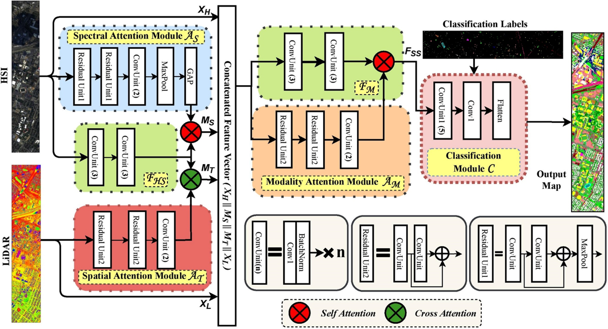

# FusAtNet-Dual-Attention-based-SpectroSpatial-Multimodal-Fusion-Network-for-Hyperspectral-and-LiDAR-Classificaition
With recent advances in sensing, multimodal data is becoming easily available for various applications, especially in remote sensing (RS), where many data types like multispectral imagery (MSI), hyperspectral imagery (HSI), LiDAR etc. are available. Effective fusion of these multisource datasets is becoming important, for these multimodality features have been shown to generate highly accurate land-cover maps. However, fusion in the context of RS is non-trivial considering the redundancy involved in the data and the large domain differences among multiple modalities. In addition, the feature extraction modules for different modalities hardly interact among themselves, which further limits their semantic relatedness. As a remedy, we propose a feature fusion and extraction framework, namely FusAtNet, for collective land-cover classification of HSIs and LiDAR data in this paper. The proposed framework effectively utilizses HSI modality to generate an attention map using "self-attention" mechanism that highlights its own spectral features. Similarly, a "cross-attention" approach is simultaneously used to harness the LiDAR derived attention map that accentuates the spatial features of HSI. These attentive spectral and spatial representations are then explored further along with the original data to obtain modality-specific feature embeddings. The modality oriented joint spectro-spatial information thus obtained, is subsequently utilized to carry out the land-cover classification task. Experimental evaluations on three HSI-LiDAR datasets show that the proposed method achieves the state-of-the-art classification performance, including on the largest HSI-LiDAR dataset available, University of Houston (Data Fusion Contest - 2013), opening new avenues in multimodal feature fusion for classification.



# URL to the paper: 
>http://openaccess.thecvf.com/content_CVPRW_2020/papers/w6/Mohla_FusAtNet_Dual_Attention_Based_SpectroSpatial_Multimodal_Fusion_Network_for_Hyperspectral_CVPRW_2020_paper.pdf

# Requirement:

```
Keras with Tensorflow 1 as backend
```
# Steps:

```
1. Download the dataset from the provided URL in data folder
```
```
2. Run data_prepare.py
```
```
3. Run model.py
```
# Citation
If using the concept or code, kindly cite the paper as: S. Mohla, S. Pande, B. Banerjee, and S. Chaudhuri. FusAtNet: Dual attention based spectrospatial multimodal fusion  network for hyperspectral and lidar classification. In The IEEE/CVF Conference on Computer Vision and Pattern Recognition (CVPR) Workshops, June 2020.

You can also use the bibtex as:
```
@InProceedings{Mohla_2020_CVPR_Workshops,
author = {Mohla, Satyam and Pande, Shivam and Banerjee, Biplab and Chaudhuri, Subhasis},
title = {FusAtNet: Dual Attention Based SpectroSpatial Multimodal Fusion Network for Hyperspectral and LiDAR Classification},
booktitle = {The IEEE/CVF Conference on Computer Vision and Pattern Recognition (CVPR) Workshops},
month = {June},
year = {2020}
} 
```
